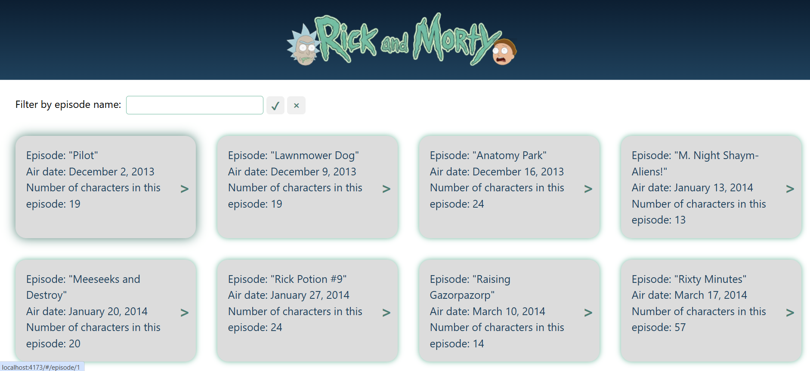

# Rick and Morty React + TypeScript + Vite SPA

This is a SPA application build with React library, Typescript language and Vite bundler.

## 📖 Table of Contents

- [About](#about)
- [Application Features](#application-features)
- [Tech Stack](#tech-stack)
- [Getting Started](#getting-started)
- [Available Scripts](#available-scripts)
- [Homepage Screenshot](#homepage-screenshot)
- [Preview URL](#preview-url)
- [API documentation](#api-documentation)

## 📌About

It's a personal vision on how the "Rick and Morty" episodes and characters information could be displayed on the UI.
It is made for learning purposes and uses the API: https://rickandmortyapi.com/.

## ✨Application features

- Displaying the Rick and Morty episodes with pagination
- Possibility to filter episode list by name
- Displaying the episode details with a list of characters for each one

## 📦Tech Stack

- [React 19](https://react.dev/) — UI library
- [Tanstack React Query](https://tanstack.com/query/latest/docs/framework/react/overview) - API query library
- [React router](https://reactrouter.com/home) - routing system
- [TypeScript](https://www.typescriptlang.org/) — static typing system
- [Vite](https://vitejs.dev/) — next-gen frontend bundler tooling
- [CSS Modules](https://vite.dev/guide/features#css-modules) - styling the application
- [Vitest](https://vitest.dev/) — testing framework

## 🚀Getting Started

### Prerequisites

- Node.js >= 24
- npm

### Installation

```bash
# Clone the repository
git clone https://github.com/cris-chiu-cucu/rick-morty-react-app.git

# Navigate into the project
cd rick-morty-react-app

# Install dependencies
npm install
```

## 📜Available Scripts

npm run dev #Start development server
npm run build #Build the application for production
npm run lint #Lint the application code
npm run preview #Preview the production build locally

## 🥃Homepage Screenshot



## 🔍Preview URL

You can see the application in action on GitHub pages following the link:
https://cris-chiu-cucu.github.io/rick-morty-react-app/

## 📄API Documentation

The application uses the flowwing API: https://rickandmortyapi.com/
